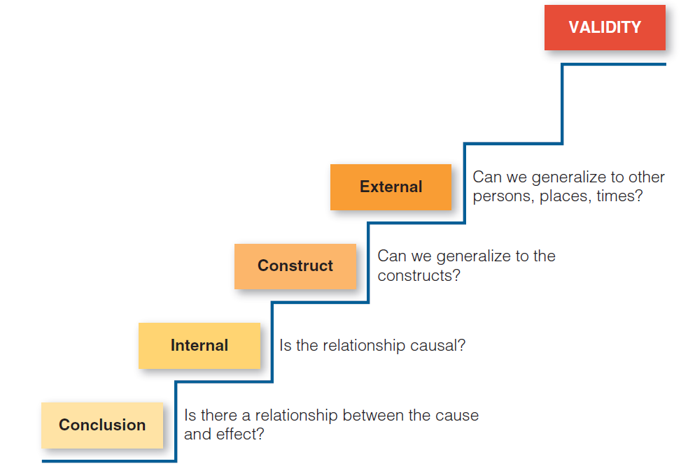

# Threats to Validity

A researcher must, somehow, guarantee the quality of her research. Validity is the term we use to discuss the quality of a proposition, or inference, or theory. It must be stressed: we don't judge whether a given research is valid, or whether some measurement is valid; we only judge whether the *research results are valid*. Obviously, we end up judging the quality of the results by the applied methods, still it doesn't make much sense to say if a method is valid.

Campbell (1979) describes validity as the best available approximation for the truth or falsity of propositions, including cause-effect relationships.

Considering then the steps of a research study, each one of them demands a certain kind of validity. For instance, a correct measurement is what guarantees the construct validity of the conclusions.

* External validity concerns *sampling*

* Construct validity concerns *measurement*

* Internal validity concerns *study design*

* Conclusion validity concerns *result analysis*

From here on, we can adopt an specific order for dealing with those validity types. From *conclusion validity*, the other types are built, using a *bottom-up* process. Adopting this order when writing them in the paper helps a lot. See the figure below for reference.

1. **Conclusion validity.** Are there any relationship between the study variables? Several conclusions are demanded by questions like this. Look at the the validity of each conclusion, evaluating the analysis methods and tools, to see how the study addresses the type of validity. In the old days, it was called "statistical" conclusion validity. *Example:* if we’re doing a study that looks at the relationship between experience level and productivity, we eventually want to reach some conclusion. Based on our data, we may conclude that there is a positive relationship, that more experienced developers tend to present higher productivity, while those with less experience tend to be less productive. *Conclusion validity is the degree to which the conclusion we reach is credible or believable*. Although conclusion validity was originally thought to be a statistical inference issue, it has become more apparent that it is also relevant in qualitative research. In an observational field study of software leaders, the researcher might, on the basis of field notes, see a pattern that suggests that woman leaders are more likely to be concerned with developer's satisfaction. Although this conclusion or inference may be based entirely on impressionistic data, we can ask whether it has conclusion validity, that is, whether it is a reasonable conclusion about a relationship in our observations.

2. **Internal validity.** assumindo que existe um relacionamento (validade anterior), que relacionamento pode ser este? Causal? Simples correlação? Essas conclusões dependem do desenho do estudo.

3. **Construct validity.** assumindo que existe um relacionamento causal (duas anteriores), podemos dizer que a medição usada mediu corretamente o conceito - a operacionalização do conceito está coerente com o conceito em si? Operacionalizar corretamente as variáveis define a validade de construto.

4. **External validity.** assumindo que existe um relacionamento causal entre variáveis corretamente medidas( 3 anteriores), você pode generalizar este efeito para outras pessoas, lugares ou épocas? Este é o tipo de validade relacionado à atividade de amostragem.

