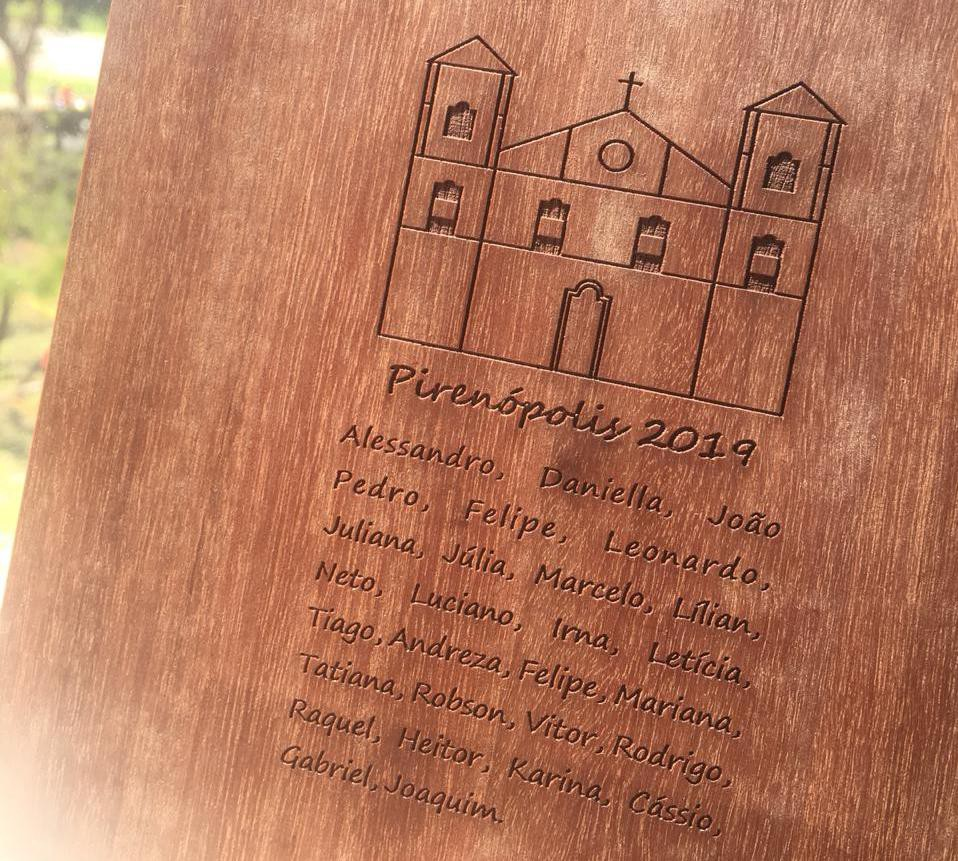

# Vielas da Memória

Acabou que ia ser um final de semana no início de 2019.

Dez anos depois da reunião de uma década de formatura. Agora são vinte anos. Adoro a gravidade da ocasião; essas coisas meio teatrais, pactos de sangue, melodramas. Tínhamos que celebrar de corpo presente — grupo de WhatsApp mantém as amarras, mas a gente precisava de um gás novo. Agora, eu ia levar todo mundo daqui, de avião, já que só eu fiz minha vida longe de Goiás. Ia ser bom deixar um pouco de lado boletos e to-do lists pra curtir uma nostalgia banal.

Em 1995, éramos um bando de magrelos de olhos arregalados, formado por meninos (em excesso) e meninas (escassas), recém-saídos da adolescência, ignorantes e deslumbrados, num desafio inédito do qual só conheciam boatos e narrativas vagas de conhecidos e familiares. Em quatro anos, o tempo escoou-se entre apostilas fotocopiadas, trajetos diários de ônibus lotado (e quase todo mundo precisava tomar dois ônibus pra casa, o campus ficava a quilômetros de qualquer outro bairro), CDs de rock comprados de segunda mão em lojinhas do centro da cidade e festas insípidas nas sextas de noite que eram o que dava pra pagar, quando não ficávamos na república do único cuja família não morava na cidade, bebendo, recitando trocadilhos e ouvindo as músicas que nunca ouvíamos naquelas festas.

Talvez exceto nas férias (irregulares, por causa de greves sazonais) — quando eu, em casa ou nos estágios curtos que fiz em empresas locais, ficava levemente desorientado — bastava seguir uma rota corriqueira, não tinha muito que escolher, já que o objetivo era só terminar o curso. Daí deve vir a ilusão de que a vida era fácil. Depois que acabou, era como se todo dia um saco de batatas caísse no meu colo, e eu tinha que descascar. Fui estapeado pela urgência das decisões críticas, aquelas que destroem as outras centenas de opções, que iriam me perseguir no futuro. Nos primeiros meses de 1999, recebemos diplomas enrolados em tubos azuis, numa discreta colação de grau (naquele tempo, cada curso fazia separadamente sua colação, o que aumentava bastante os custos da comissão de formatura; por isso não tivemos um baile, apenas um coquetel, mesmo assim confirmado apenas dias antes). Então os cansados ex-estudantes de Ciência da Computação da UFG percebiam que estavam saindo de uma roubada pra entrar em outra maior ainda.

Fomos então com nossas malas pesadas rumo ao centro-oeste. Confesso que eu estava alvoroçado; despertei no meio da madrugada da véspera do encontro com náusea e vertigens, efeitos de uma crise de ansiedade. Estava corporificando o temor de, depois de tantos anos sem voltar à cidade ou rever os amigos, ser privado daquele final de semana por alguma banalidade. Tomei um remédio, e em poucas horas parecia recuperado. Ainda assim o medo de voltar a me sentir mal novamente me acompanhou até a noite do primeiro dia.

Encontrei todos da turma numa pousada de entrada quase oculta entre fachadas coloniais de residências, lojas e cafés na cidade de Pirenópolis. Entre a recepção e os quartos, caminhamos sobre um tablado de madeira escura envernizada, e o ruído dos pés anunciava a chegada de uma turma que iria ocupar metade dos chalés. Poucos metros de relvado separavam esses chalés, assim nos sentimos mais livres pra invadir os espaços de cada um, sem reservas, principalmente as crianças. Almoçamos e jantamos juntos, e conseguimos evitar as armadilhas pra turistas nas caminhadas pelas ruas calçadas em finas tiras de pedra. No fim, nem deu vontade de visitar as cachoeiras.

Os fios soltos das lembranças iam se reconectando devagar, sem dar bola pro longo tempo. Tinha nove anos que fiquei longe, e não encontrara mais no mesmo lugar a maioria dessas testemunhas de tantos erros, confidências e exageros, mas também de momentos que eu classificaria como próximos do sublime. Curiosamente, eu sentia estar construindo novas conexões de memória, que traziam inesperadas interpretações daquilo que havia acontecido. Se por um lado esse fenômeno frustra algumas idealizações sobre os eventos cultivadas nesses anos, outras alegrias inesperadas despontam da repaginação de histórias que, mesmo não trazendo nenhum fato novo, adquirem um frescor pelo jeito diferente de se contar, ou pela importância diferente dada a elas pela amiga que relembra; enquanto o término de um namoro que eu achara ter sido doloroso na época era na verdade motivo de piada pro suposto sofredor, uma festa de que tinha péssima lembrança torna-se, do nada, um evento épico pelos percalços sofridos por uma dupla de amigos alcoolizados.

Era impressionante como um de meus amigos que, com a mesmo eloquência e bom humor dos quais eu me lembrava, demonstrou um registro preciso dos nomes e apelidos das pessoas que passaram pela nossa vida, professores, colegas, funcionários, e outros personagens, mesmo que tenham compartilhado da nossa companhia por minutos. Tais recordações, talvez por serem hoje tão inofensivas, me fizeram rir como já dificilmente faço; na vida adulta, parece ser impossível achar coisas inofensivas. A partir de um momento da vida, tudo parece ter uma consequência: uma cerveja deixa a barriga estufada e dá dor de cabeça, assim como uma palavra mal colocada provoca julgamentos. Por coisas assim, não tivemos a presença de um dos amigos mais queridos daquele grupo, já que se afastou da turma a pedido da pessoa com quem ele se casou depois — coisa madura, de adulto.

Naquele tempo, vivíamos numa bolha de proteção mútua, em tese nos livrando de problemas maiores quando experimentávamos alguma transgressão, ou quando provocávamos alguém ou algo só pela expectativa da reação. Aquilo que nos desperta ternura e nostalgia é a sensação de que, por algum tempo nas nossas vidas, éramos invencíveis. Uma tristeza não era um sintoma de depressão crônica, era apenas uma tristeza. Uma dor de cabeça não dava medo de ser diagnosticado com um distúrbio grave, um analgésico e pronto, já se esquecia. Um embaçamento da vista era só resultado de uma semana de provas, não o sinal de uma doença incapacitante surgindo. Nossos medos eram mesquinhos e prosaicos; aquilo que esquentava nossos miolos só pedia um refresco, não a revolução que hoje parece necessária pra resolver nossos problemas. Ao terminar nossos estudos, vencemos. Mas a vitória final ironicamente marcou o fim daquele tempo em que nada nos derrotava. Sabemos não ter o que fazer quanto a isso, é apenas o ciclo de tudo que sempre acontece, o que nos permitiu ter filhos e seguir com nossas vidas de algum jeito.

Acabou que o final de semana foi bem, muito bem. Muita conversa, sem pressa, sem aborrecimento. Havia uma suspensão da realidade, em que deixamos as reservas em algum outro lugar, soltando besteiras que em qualquer outro contexto seriam apenas tolas, mas que aqui revelam uma leveza impossível de emular em qualquer outro lugar ou tempo da vida. Acho que todos nós percebemos, talvez um pouco surpresos, essa falta de formalidade; acabou sendo espontâneo. Hoje, se eu saio de casa com o objetivo de ser informal e sem frescura pra ir em algum lugar, acontece exatamente o oposto, eu fico ainda mais travado.

Talvez a única diferença que saltava aos olhos eram as proles. Todos os agora pais e mães zelavam pelos seus pequenos, e estes se juntaram rápido — facilitando a nossa vigília, porque todas as crianças cuidavam de todas as outras. Se um caia e se machucava, metade das crianças ficava consolando o chorão enquanto a outra metade, cheios de importância, ia correndo chamar o pai e a mãe (sim, ambos). A semelhança no trato das crianças sinaliza o vínculo que imaginamos ter como pessoas: se dois casais de pais transferem pros filhos valores e visões de mundo parecidas, não é absurdo supor que a ligação entre esses casais é mais forte do que uma simples simpatia. Assim a turminha dos pequenos se une à nossa galeria de recordações.

Final de tudo, despedidas, promessas de encontros menos raros; veio a viagem de volta, o desarrumar das malas em casa, e o lembrete de que a engrenagem não para. Enquanto reorganizava minhas miudezas nas gavetas e prateleiras do quarto, me perguntei se isso tudo não era apenas nostalgia, no pior sentido da palavra — um esconderijo pra quando estamos apavorados pelo rugido da besta que, pela manhã, nos espera atrás da porta de casa ou, de noite, fica lá fora depois de termos fugido dela o dia todo. Não consegui achar uma resposta.

Essas recordações são um alívio sim, um pingo de doce. Como uma cidade grande precisa de parques pros seus habitantes se sentirem livres da opressão das caixas cinzentas por algumas horas. As lembranças precisam ser resgatadas e revividas, porque elas acabam morrendo um dia, enxotadas por nossas mentes imperfeitas e envelhecidas. Vivemos em ruas e avenidas, acelerando no sinal verde, seguindo nossos caminhos retos e lisos; quando paramos, basta um segundo pra botar os olhos nas telas. Nesse ritmo deixamos de nos perder em vielas quase ocultas, onde nas casas só chegamos através de escadas longas e escorregadias, ladeadas por pequenas janelas redondas translúcidas que, quando enfim abertas, nos revelam um corredor de que não se vê o fim, com seus quartinhos que, cheios de móveis velhos e paredes descascando, guardam nossos tesouros.

*PS: Dedico esse texto àquela menininha que estava lá, mas que já tinha passado da idade pra brincar com as crianças.*
